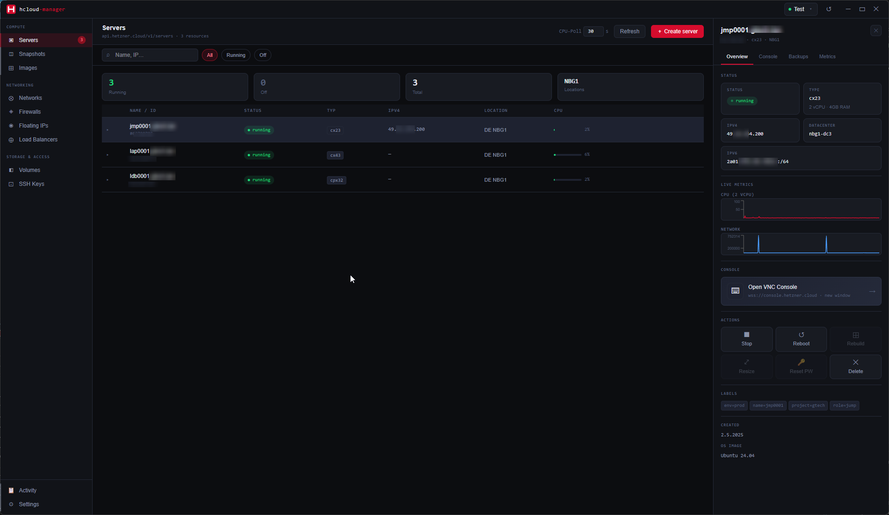

# hcloud-manager

[](https://ko-fi.com/devgonzi)

> eine desktop-app zum verwalten von hetzner cloud. weil das web-ui okay ist, man aber manchmal einfach was natives in der taskleiste haben will.

**[English Version](README.md)**



---

## was ist das hier

eine electron-app die mit der hetzner cloud api redet und damit server, firewalls, netzwerke, volumes, ssh keys, floating ips, load balancer, snapshots, images verwalten kann - so ziemlich alles halt. dark theme, live cpu-metriken, vnc-konsole, das volle programm.

gebaut weil ich ~15 server über 3 projekte verteilt manage und das dauernde durchklicken im hetzner web-ui irgendwann nervig wurde. proxmox hat diesen vibe wo man alles auf einen blick sieht. das wollte ich für hetzner haben.

das eigentliche problem das es löst: du bist mitten im code, irgendwas stimmt nicht, du musst kurz einen server neustarten oder checken ob die cpu durch die decke geht. hetzner web-ui bedeutet - tab finden (irgendwo zwischen den anderen 50), warten bis er lädt, neu einloggen weil die session abgelaufen ist, zum richtigen projekt navigieren, server suchen. gedankengang weg. diese app sitzt in der taskleiste. klick, fertig, weiter.

ist nicht perfekt. ist open source. PRs willkommen.

---

## was geht aktuell

- **multi-projekt** - beliebig viele hetzner-projekte hinzufügen, zwischen ihnen wechseln. api-keys werden verschlüsselt via electron safeStorage gespeichert, nicht irgendwo im klartext auf der festplatte
- **readonly-modus** - pro-projekt flag das alle schreibenden aktionen deaktiviert. nützlich wenn man jemandem zugang zum monitoring geben will ohne dass er aus versehen nachts einen produktions-server abschießt
- **server** - starten, stoppen, rebooten, live cpu-graph, server-details, konsole
- **vnc-konsole** - öffnet sich in einem separaten fenster, verbindet zu `wss://console.hetzner.cloud`. funktioniert tatsächlich
- **live-metriken** - cpu und netzwerk-graphen die die hetzner metrics api in einem konfigurierbaren interval abfragen
- **firewalls** - regeln anzeigen (inbound/outbound), sehen auf welchen servern sie aktiv sind, löschen
- **netzwerke** - listenansicht mit subnets und routes
- **floating ips** - auflisten, erstellen, zuweisungsstatus sehen
- **load balancer** - liste mit services und targets
- **volumes** - auflisten, erstellen, attachment-status sehen
- **snapshots** - von laufenden servern erstellen, löschen, zu image konvertieren
- **images** - system- und app-images durchsuchen (snapshots haben eine eigene seite)
- **ssh keys** - auflisten, hinzufügen, löschen, fingerprint kopieren
- **backups** - pro-server backup-verwaltung, aktivieren/deaktivieren, einzelne backups löschen
- **i18n** - deutsch und englisch, wechselt live
- **sicherheit** - PIN-schutz mit 6-stelligem code, persistentes activity log, auto-lock mit Strg+L hotkey


---

## sicherheit

die app beinhaltet mehrere sicherheits-features zum schutz der infrastruktur:

### PIN-schutz
- **setup**: geh in die einstellungen, setze einen 6-stelligen PIN. wird verschlüsselt in `app-config.json` gespeichert
- **verwendung**: app sperrt sich beim start wenn PIN gesetzt ist. entsperre mit deinem PIN um fortzufahren
- **hotkey**: drücke `Strg+L` oder klick den 🔒 button in der titelleiste um die app jederzeit zu sperren
- **activity log**: alle server-aktionen (erstellen, löschen, starten, stoppen, reboot, etc) werden protokolliert mit timestamp, resource-typ und ergebnis. bleibt über restarts erhalten in `actionlog.json`

### datenschutz
- **api keys**: hetzner api-keys werden verschlüsselt gespeichert via electron's `safeStorage` mechanismus (os-level verschlüsselung auf windows/mac/linux)
- **readonly-modus**: pro-projekt flag das alle schreibenden aktionen deaktiviert - nützlich für shared environments oder nur-monitoring-zugang

---

## geplant / fehlt noch

- [ ] biometrische authentifizierung (windows hello, mac touchid) - fallback auf PIN
- [ ] netzwerke und volumes detail-ansichten (aktuell nur read-only-liste)
- [ ] floating ip zuweisen/entfernen im ui
- [ ] load balancer target-verwaltung
- [ ] auto-updater
- [ ] server-erstellen-wizard (basisversion existiert, braucht noch arbeit)

wenn du was davon implementieren willst: issue aufmachen damit wir nicht das gleiche gleichzeitig bauen.

---

## falls du noch kein hetzner hast

ernsthaft einer der besten vps-anbieter. günstig, eu-basiert, schnelles netzwerk, saubere api die tatsächlich dokumentiert ist, keine bösen überraschungen auf der rechnung. nutze die seit jahren.

mit dem referral-link kriegst du 20€ credits und ich auch was:

**➜ [hetzner.cloud/?ref=Rb92rAsFUGWC](https://hetzner.cloud/?ref=Rb92rAsFUGWC)**

---

## installation

### fertiger release

aktuellste version in den [releases](https://github.com/DevGonzi/hcloud-manager/releases).

| plattform | datei                                     |
| --------- | ----------------------------------------- |
| windows   | `.exe` installer                          |
| linux     | `.AppImage`                               |
| mac       | `.dmg` (ungetestet, sollte funktionieren) |

### selbst bauen

braucht node 18+ und npm.

```bash
git clone https://github.com/DevGonzi/hcloud-manager.git
cd hcloud-manager
npm install

npm run dev          # dev-modus mit hot reload
npm run build:win    # windows paket
npm run build:linux  # linux paket
npm run build:mac    # mac paket (viel erfolg)
```

---

## tech stack

- [electron](https://electronjs.org) + [electron-vite](https://electron-vite.org)
- react 18 + typescript
- [zustand](https://github.com/pmndrs/zustand) für state
- [recharts](https://recharts.org) für die metrik-graphen
- [novnc](https://github.com/novnc/noVNC) für die vnc-konsole
- inline styles mit css-variablen (hatte tailwind v4, hatte kämpfe damit, gewonnen durch nicht benutzen)
- JetBrains Mono weil monospace ist die ästhetik

---

## projektstruktur

```
src/
  main/         # electron main process - ipc handler, hetzner api client, ttl cache
  preload/      # contextBridge - gibt der renderer-seite die api auf sichere art
  renderer/     # die eigentliche react-app
    pages/      # eine datei pro ressource-typ (server, netzwerke, firewalls, etc)
    components/ # geteilte teile (sidebar, titelleiste, server-detail-panel, metrik-charts)
    stores/     # zustand stores für server und projekte
    i18n/       # de.json + en.json
  shared/       # typescript-typen die main und renderer teilen
```

---

## mitmachen

fork, fix, PR aufmachen. kein strikter prozess. wenn die ci durchläuft und es nicht komplett durchgeknallt aussieht, kommt's wahrscheinlich rein.

bugs: issue aufmachen. reproduktionsschritte helfen enorm. "geht nicht" weniger.

---

## unterstützung

Wenn hcloud-manager dir Zeit spart, freue ich mich über einen Kaffee ☕

[](https://ko-fi.com/devgonzi)

---

## lizenz

MIT. mach was du willst.

---

_– [gonzi](https://github.com/DevGonzi)_
